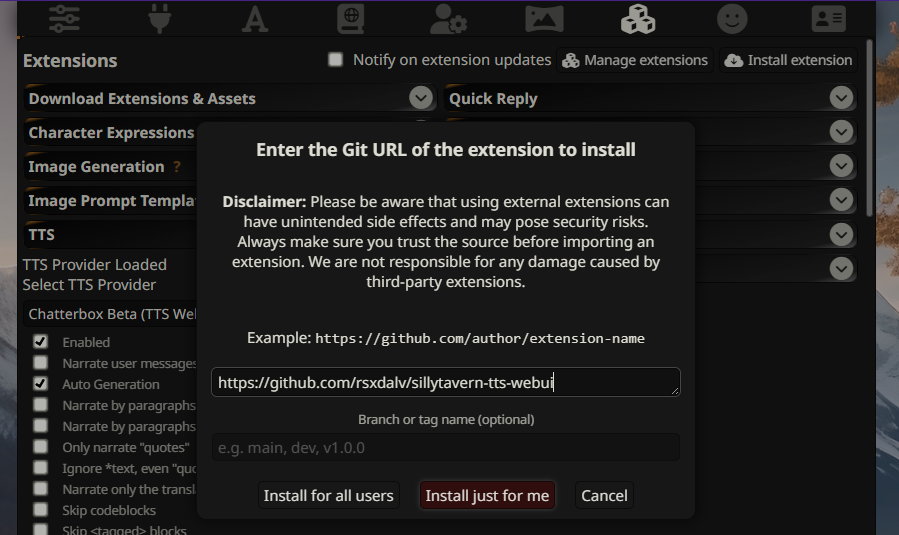

# TTS WebUI Adapter for SillyTavern

This is an extension for [SillyTavern](https://github.com/SillyTavern/SillyTavern) that allows you to use [TTS WebUI](https://github.com/rsxdalv/tts-webui) as a TTS provider.

Models: Chatterbox

## Installation

Press the "Install Extension" button in the Extensions tab.
Enter this repository's URL: https://github.com/rsxdalv/sillytavern-tts-webui
Press "Install from URL".
